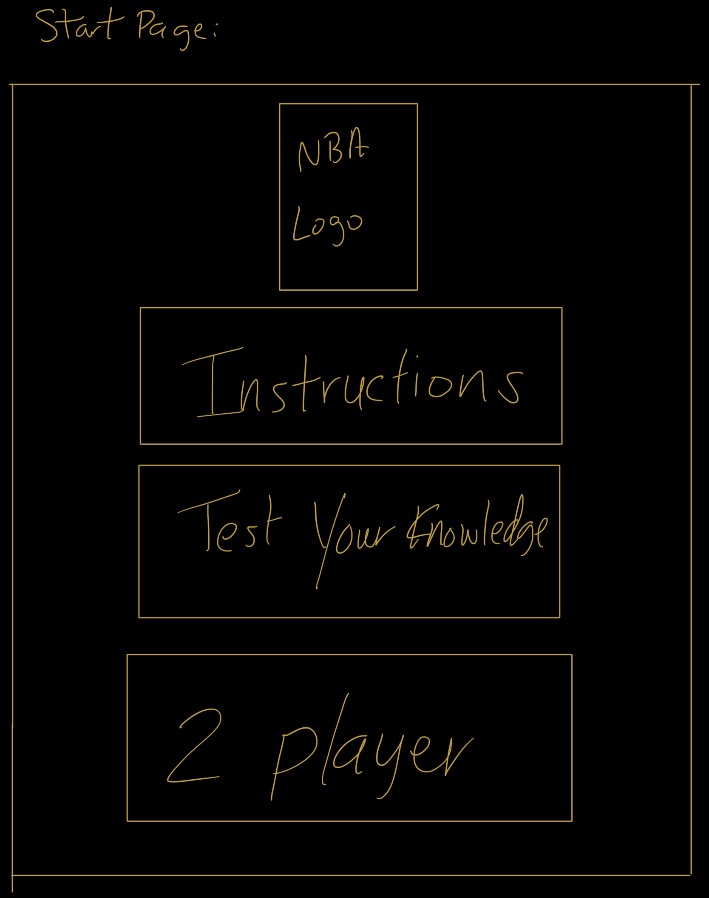
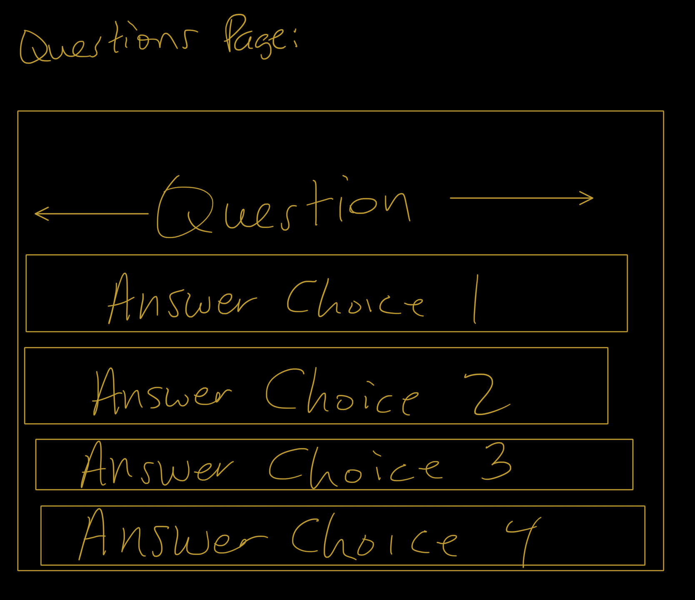

# App Title: 

### App Demo: https://afbelardi.github.io/README/

---

## Concept:

This project is for people who love basketball and the NBA as much as I do. The goal is to test your knowledge about the NBA
and challege your friends to see who knows more.

## Technologies Used:

* HTML
* CSS
* JavaScript 
* External JavaScript Library

##### Credits:

    https://www.schemecolor.com/national-basketball-association-logo-colors.php
    https://icebreakerideas.com/nba-trivia/

## Approach:


#### Overview


#### Wireframe

    
    

Color Pallet:

```
    ##17408B
    #C9082A
    #ffffff
```

#### User stories

The user should expect to see the NBA logo when loading the page as well as two button options - one for instructions and the other to start the two 
player game. The first user will be greeted with 5 questions and the ability to earn up to 500 points, which is displayed. The second user then takes 
their turn. Both users are able to know their score at the end and find out what rank they received. 

#### Development Plan 


* Development Plan One:  Create an array of trivia questions to pull from.
* Development Plan Two: Design the layout of the front page and questions page through HTML, CSS and jQuery.
* Development Plan Three:  Pull random questions with the corresponding answers from the trivia questions array and be able 
to log if the user got the question right or wrong.
* Development Plan  Four: Have the user's score populate on the DOM and then compare scores between Player 1 and 2 at the end as 
well as assign them the rank of Rookie, All-Star or Hall-of-Famer.

#### MVP

* MVP ONE: Built with HTML, CSS, JavaScript and jQuery
* MVP Two: Hosted on github pages
* MVP Three: Commits to github everyday
* MVP Four: A README.md file with explanations of the technologies used, the approach taken, a link to your live site, 
installation instructions, unsolved problems, etc.

#### Stretch goals

* Stretch goals ONE: Have the NBA on ABC theme song play when the instruction modal opens
* Stretch goals Two: Add sound effects for right/wrong answers and use modals for right or wrong answers instead of alerts
* Stretch goals Three: Add an option to just play with one player
* Stretch goals Four: Have a photo of a rookie, all-star or hall of fame player pop up at the end with the corresponding photo instead of 
using an alert. Also be able to restart the game. 

## Challenges:

A big challenge I faced was getting the questions with corresponding answers to cycle through. At first, the game wouldn't cycle through any questions
at all. Afterwards I faced problems such as the wrong list of answers showing up as well as clicking on the correct answer and the game responding with an
alert that said it was incorrect. 


### App Demo: https://afbelardi.github.io/README/
